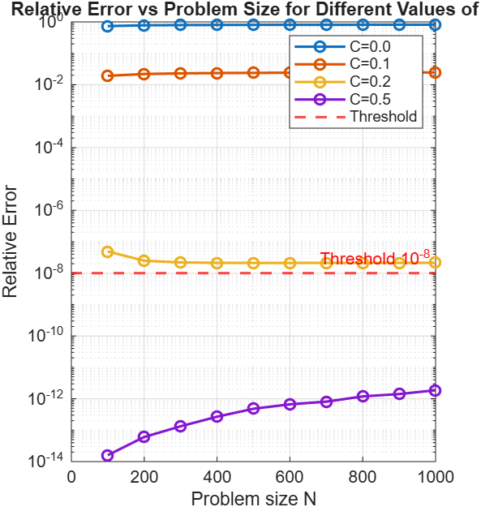
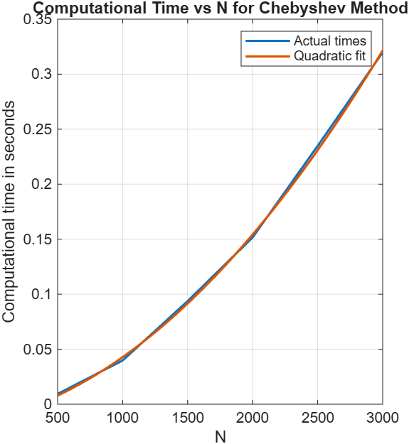

# Matrix Function Approximation with Chebyshev Polynomials

**Ava Labmeier**

---

# 1. Theory

## 1.1 Matrix Functions and Spectral Decomposition

Let (A \in \mathbb{R}^{N \times N}) be a symmetric matrix. By the spectral theorem,

[
A = U\Lambda U^T,
]

where (U) is orthogonal and

[
\Lambda = \text{diag}(\lambda_1,\lambda_2,\ldots,\lambda_N).
]

For a polynomial

[
p(x)=\sum_{k=0}^{m} c_k x^k,
]

we have

[
p(A)=Up(\Lambda)U^T.
]

Since powers of (A) satisfy

[
A^k = U\Lambda^kU^T,
]

it follows that

[
p(A)
====

# \sum_{k=0}^{m} c_k A^k

U
\left(
\sum_{k=0}^{m} c_k \Lambda^k
\right)
U^T.
]

Therefore matrix functions can be evaluated by applying the function directly to the eigenvalues.

---

## 1.2 Polynomial Approximation of Matrix Functions

Suppose ({p_k}) is a sequence of polynomials converging to a function (f) on an interval ([a,b]).

Then

[
f(A)
====

# \lim_{k\to\infty} p_k(A)

U f(\Lambda) U^T.
]

This definition is independent of the particular polynomial sequence chosen because convergence occurs at each eigenvalue.

---

## 1.3 Matrix Exponentials

For a function represented by a convergent Taylor series,

[
f(x)
====

\sum_{k=0}^{\infty}
a_k(x-c)^k,
]

the corresponding matrix function is

[
f(A)
====

\sum_{k=0}^{\infty}
a_k(A-cI)^k.
]

In particular,

[
e^A
===

\sum_{k=0}^{\infty}
\frac{A^k}{k!}.
]

---

# 2. Motivation

The objective of this project is to efficiently compute matrix-vector products of the form

[
f(A)v,
]

where (A) is a large sparse matrix.

A direct eigendecomposition requires approximately (O(N^3)) operations, making it impractical for large problems.

Instead, we:

1. Approximate (f) using Chebyshev polynomials.
2. Map the spectral interval of (A) to ([-1,1]).
3. Use the three-term Chebyshev recurrence relation.
4. Compute only matrix-vector products.

This approach avoids explicitly forming (f(A)) and takes advantage of matrix sparsity.

---

# 3. Implementation

## 3.1 Chebyshev Polynomial Evaluation

Chebyshev polynomials are evaluated using the recurrence

[
T_{n+1}(x)
==========

2xT_n(x)-T_{n-1}(x),
]

with

[
T_0(x)=1,
\qquad
T_1(x)=x.
]

This recurrence is implemented in `cheb_eval.m`.

---

## 3.2 Chebyshev Coefficient Computation

The coefficients of the approximation are computed using Gauss-Chebyshev quadrature.

The interval ([a,b]) is mapped to ([-1,1]), and numerical integration is used to obtain the coefficient vector

[
c=(c_0,c_1,\ldots,c_n).
]

This procedure is implemented in `cheb_coeff.m`.

---

## 3.3 Matrix-Vector Approximation

The matrix is first transformed so that its spectrum lies in ([-1,1]).

Using the Chebyshev coefficients, the approximation

[
f(A)v
]

is computed through the three-term recurrence without explicitly forming (f(A)).

Only sparse matrix-vector multiplications are required, making the method scalable for large matrices.

This procedure is implemented in `cheb_matvec.m`.

---

# 4. Numerical Experiments

## 4.1 Relative Error Analysis

To evaluate accuracy, the Chebyshev approximation was compared against the exact matrix exponential computed using MATLAB's `expm` function.

Experiments were conducted for

[
N = 100,200,\ldots,1000
]

and

[
C \in {0.01,0.1,0.25,0.5},
]

where the polynomial degree was chosen as

[
n = CN.
]

Relative error was computed as

[
\frac{|w_{\text{approx}}-w_{\text{true}}|}
{|w_{\text{true}}|}.
]

### Figure 1. Relative Error Analysis

The results show that approximation accuracy improves as the truncation parameter increases. Values of (C=0.5) consistently remain below the target threshold of (10^{-8}), while smaller values of (C) produce larger approximation errors.

---

## 4.2 Runtime Analysis

To study computational complexity, runtimes were measured for

[
N = 500,1000,\ldots,3000.
]

A quadratic polynomial was fit to the measured runtimes.

### Figure 2. Runtime Scaling

The measured runtimes closely follow the fitted quadratic curve, confirming the expected (O(N^2)) scaling behavior of the implementation.

---

# 5. Conclusion

This project implemented a Chebyshev polynomial approach for approximating matrix functions applied to vectors.

By avoiding explicit eigendecomposition and relying only on sparse matrix-vector products, the method provides a computationally efficient alternative for large sparse matrices.

Numerical experiments demonstrated both high approximation accuracy and favorable runtime scaling, making Chebyshev methods an effective tool for large-scale matrix function computations.
